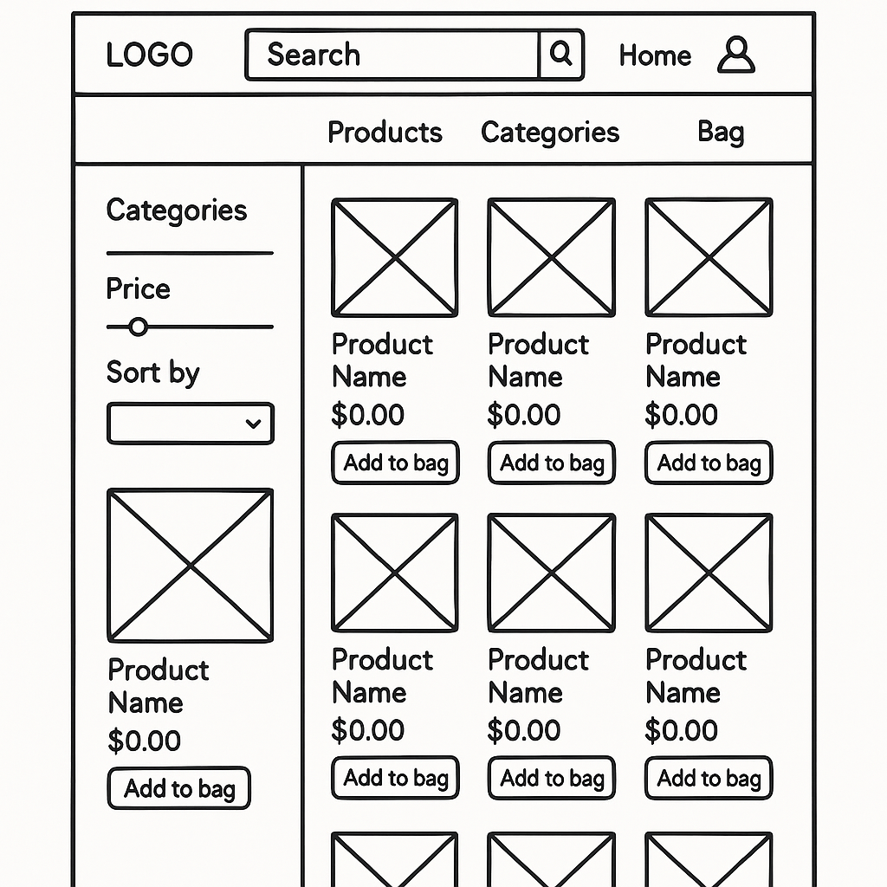
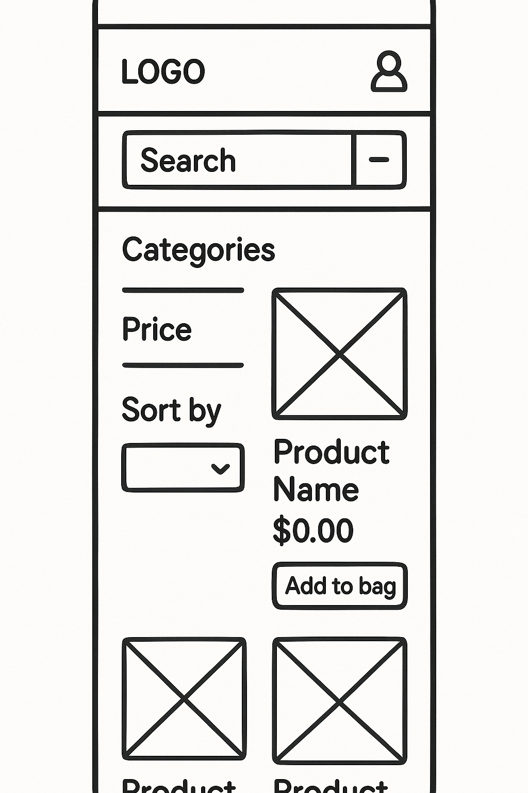
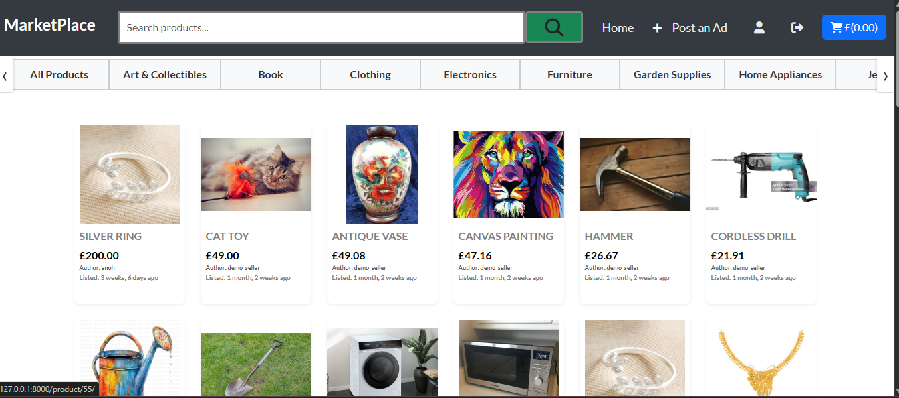
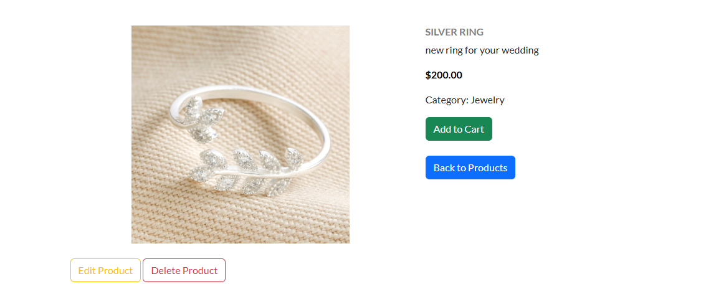
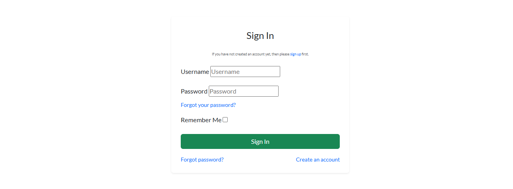
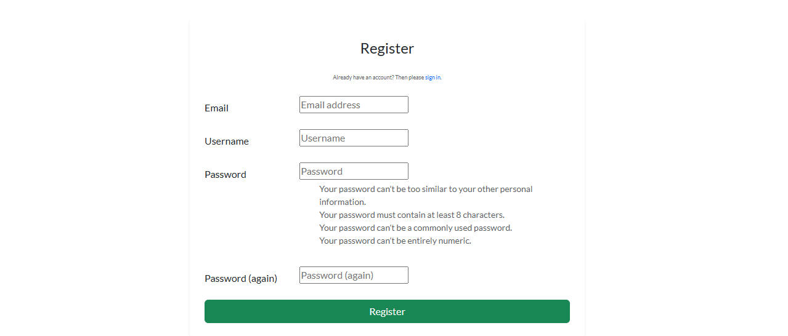
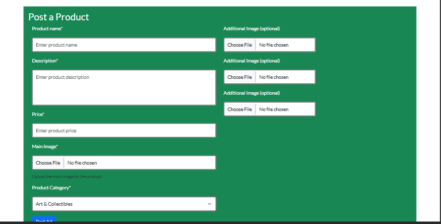
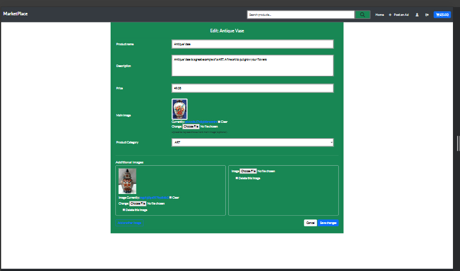
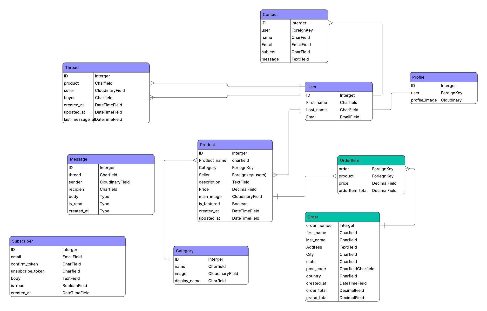
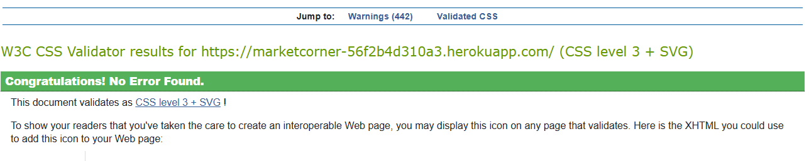

Marketplace is a Django-based web application and Minimum Viable Product (MVP) designed to showcase core full-stack functionality. The platform enables users to register, log in, browse products and initiate purchasing products.

This project demonstrates my ability to build scalable, modular Django applications with clean UI using Bootstrap. While this version includes essential features, it is intentionally lean to highlight core functionality. The UX and feature set can be expanded based on future goals or user feedback.

## 📚 Table of Contents
- [User Experience](#user-experience)
  - [For General Users](#for-general-users)
  - [For Admin Users](#for-admin-users)
  - [Accessibility Considerations](#accessibility-considerations)
- [Wireframes](#wireframes)
- [Screenshots](#screenshots)
- [Features](#features)
- [Fonts](#fonts)
- [Tech Stack](#tech-stack)
- [Database Schema (ERD)](#database-schema-erd)
- [Manual Testing](#manual-testing)
- [HTML and CSS Validation](#html-and-css-validation)
- [Installation](#installation)
- [Deployment](#deployment)
- [Acknowledgment](#acknowledgment)
- [License](#license)


<a id="user-experience"></a>
## 🧠 User Experience

<a id="for-general-users"></a>
### ✅ For General Users

As a regular user of **Marketplace**, I want to:

- Access the website seamlessly across all devices — desktops, laptops, tablets, and smartphones.
- Navigate a clean, consistent, and responsive interface with intuitive menus.
- Browse for products and search for products by title or description.
- View detailed information about each product, including images, title, price and description.
- Register or log in quickly using a username.
- Purchase products by adding products to shopping bag and cheching out
- Return to the homepage or previous browsing state without confusion.
- Receive immediate visual feedback when submitting forms.
- View confirmation messages after actions like adding a products or deleting a product plus registration and signin.
- Restart or return to the products easily.

<a id="for-admin-users"></a>
### 🔧 For Admin Users

As an admin, I want to:

- Access a secure, user-friendly admin interface.
- Add or update products with fields like title, description, category, and images.
- View and manage purching activity.
- Access the admin dashboard via a protected URL.
- Receive validation messages when managing products.
- Upload media through integrations like Cloudinary.

<a id="accessibility-considerations"></a>
### ♿ Accessibility Considerations

- Use semantic HTML and heading structure for screen readers.
- Ensure color contrast for readability.
- Include `alt` text for all book cover images.
- Support keyboard navigation.
- Show clear error messages and form validation.

---

#

<a id="wireframes"></a>
## Wireframes 

Desktop



Mobile




<a id="screenshots"></a>
## 📸 Screenshots
## home page


Product details desktop




### 🔐 Login Page



### Register page



### Post product page


### edit product page



<a id="features"></a>
## 🚀 Features

- 🔍 Search for products by title 6r descr
- 📝 User registration and login
- 📷 product images upload via Cloudinary
- 🔐 Authentication using `django-allauth`
- 🖼️ Responsive design with Bootstrap 5

---

<a id="fonts"></a>
## 🎨 Fonts

- IM Fell French Canon SC was used as the main font.

<a id="tech-stack"></a>
## 🛠️ Tech Stack

- **Backend**: Django 5+
- **Frontend**: HTML, CSS (Bootstrap), JavaScript
- **Database**: PostgreSQL
- **Media Storage**: Cloudinary
- **Authentication**: `django-allauth`

---

<a id="database-schema-erd"></a>
## 🗺️ Database Schema (ERD)

Below is an overview of the core entities in **Marketplace** and how they relate




<a id="manual-testing"></a>
## Manual Testing  <!-- fix "Manaul Test" typo -->

| Test Case                    | Action                                    | Expected Outcome                                 |
| ---------------------------- | ----------------------------------------- | ------------------------------------------------ |
| Register with valid inputs   | Fill in registration form with valid data | Account is created and user is logged in         |
| Register with duplicate user | Use an existing username                  | Error message: "This username is already taken." |
| Login with correct details   | Enter valid username and password         | User is logged in successfully                   |
| Login with wrong password    | Enter valid username but wrong password   | Error message is displayed                       |

| Test Case          | Action                                         | Expected Outcome                                |
| ------------------ | ---------------------------------------------- | ----------------------------------------------- |
| View homepage      | Visit `/`                                      | products are displayed         |
| Click a product card  | Click on a product from homepage or category list | Redirected to book detail page with description |
| Filter by category | Click on category (e.g., gardening, clothing)     | Only products from that category are shown         |
| Search for a products  | Use the search input with a keyword            | Matching products are shown                        |

📚 product Browsing and Details
| Test Case | Action | Expected Outcome |
| ------------------ | ---------------------------------------------- | ----------------------------------------------- |
| View homepage | Visit `/` | products  are displayed |
| Click a product card | Click on a product from homepage or category list | Redirected to book detail page with description |
| Filter by category | Click on category (e.g., electronic, funiture) | Only poducts from that category are shown |
| Search for a products | Use the search input with a keyword | Matching products are shown |


## Other testing:

✅ Functional Testing

| Feature                | Test Description                                               | Status   |
| ---------------------- | -------------------------------------------------------------- | -------- |
| User Registration      | Users can register with valid credentials and become borrowers | ✅ Passed |
| Login/Logout           | Registered users can log in and out securely                   | ✅ Passed |
| product Listing           | All products display with title, image, and details               | ✅ Passed |
| product Search            | Users can search for products by title or description             | ✅ Passed |
| product Borrowing         | Logged-in users can buy products                    |✅ Passed |
| Admin Controls         | Admin users can manage orders via the admin panel | ✅ Passed |

🎯 Usability Testing

| Area                     | Test Description                                                         | Status   |
| ------------------------ | ------------------------------------------------------------------------ | -------- |
| Form Validation          | All forms provide user-friendly error messages for invalid input         | ✅ Passed |
| Navigation               | Menus and navigation links are intuitive and accessible                  | ✅ Passed |
| Feedback                 | Success/error messages shown after actions like purchase, edit, register | ✅ Passed |
| Modal Reviews (if used)  | Edit/delete review modals are functional and accessible                  | ✅ Passed |
| Active Link Highlighting | Navigation bar highlights current page                                   | ✅ Passed |

📱 Responsive Design Testing

| Device/Screen Size      | Test Description                                                              | Status   |
| ----------------------- | ----------------------------------------------------------------------------- | -------- |
| Mobile (≤ 768px)        | Content adapts properly, cards stack vertically, nav collapses into hamburger | ✅ Passed |
| Tablet (768px - 1024px) | Grid adjusts, buttons and forms remain accessible                             | ✅ Passed |
| Desktop (≥ 1024px)      | All components appear consistently with full layout                           | ✅ Passed |
| Image Scaling           | product images maintain aspect ratio and fit container                     | ✅ Passed |


🗃️ Data Management Testing

| Data Layer                 | Test Description                                                           | Status   |
| -------------------------- | -------------------------------------------------------------------------- | -------- |
| Database Migrations        | All models and fields migrate without errors                               | ✅ Passed |

| Edge Cases                 | Handles duplicate registrations, invalid accesing shopping cart, and missing data | ✅ Passed |


<a id="html-and-css-validation"></a>
## ✅ HTML and CSS Validation

The W3.org html validator was use to validate the project using the deployed link

- https://bookhiver-5fd96c570ace.herokuapp.com/
  

-

Validated using [W3C HTML Validator](https://validator.w3.org/) and [W3C CSS Validator](https://jigsaw.w3.org/css-validator/):

---

## 🧹 JavaScript Linting with ESLint

This project uses **ESLint** to lint and automatically fix JavaScript code in the static files.

### 📦 Setup Instructions

1. **Install ESLint:**

   ```bash
   npm install eslint --save-dev
   ```

2. **Initialize ESLint:**

   ```bash
   npx eslint --init
   ```

   Recommended setup during prompts:

   - Purpose: _To check syntax, find problems, and enforce code style_
   - Module type: _JavaScript modules_
   - Framework: _None_
   - Environment: _Browser_
   - Config format: _JavaScript or JSON_

3. **Organize JS Files:**
   Ensure your JavaScript files are stored inside your app’s `static/js/` folder.

---

### 🛠 Linting and Auto-Fixing

#### 🔍 Run Lint:

```bash
npx eslint yourapp/static/js/**/*.js
```

#### 🔧 Auto-Fix Issues:

```bash
npx eslint yourapp/static/js/**/*.js --fix
```

#### 💡 Add to `package.json` Scripts:

```json
"scripts": {
  "lint": "eslint yourapp/static/js/**/*.js",
  "lint:fix": "eslint yourapp/static/js/**/*.js --fix"
}
```

Then run:

```bash
npm run lint
npm run lint:fix
```

---

### ⚙️ Optional: Auto-Fix on Save (VSCode)

If using **Visual Studio Code**, add this in `.vscode/settings.json`:

```json
{
  "editor.codeActionsOnSave": {
    "source.fixAll.eslint": true
  },
  "eslint.validate": ["javascript"]
}
```

Make sure the ESLint extension is installed in VSCode.

<a id="installation"></a>
## ⚙️ Installation

1. Clone the repository:

```bash
git clone https://github.com/enocol/donewithit.git
cd donewithit
npm install
```

---

<a id="deployment"></a>
## 🚀 Deployment

To deploy marketplace to a live production environment (e.g., Heroku), follow these steps:

#### 1. Make sure in your settings.py file in the project, debug is set to False before commiting and pushing your code

settings.py
DEBUG=False

````

#### 2. **Environment Variables**

Use `os.environ` to manage secrets:

```python
import os
SECRET_KEY = os.environ.get("SECRET_KEY")
DATABASE_URL = os.environ.get("DATABASE_URL")
````

Set these in Heroku's config vars:

- `DATABASE_URL = <Heroku PostgreSQL URL>`
- `CLOUDINARY_URL` if using Cloudinary

#### 3. **Dependencies**

Ensure your `requirements.txt` includes:

```txt
django
whitenoise
dj-database-url
django-allauth
cloudinary
python-decouple
gunicorn
psycopg2-binary
```

#### 4. **Static and Media Files**

- Use WhiteNoise to serve static files:

  ```python
  MIDDLEWARE = [
    'whitenoise.middleware.WhiteNoiseMiddleware',
    ...
  ]
  STATICFILES_STORAGE = 'whitenoise.storage.CompressedManifestStaticFilesStorage'
  ```

- Run:

  ```bash
  python manage.py collectstatic
  ```

#### 5. **Database Setup**

```bash
python manage.py makemigrations
python manage.py migrate
```

#### 7. **Differences Between Dev and Prod**

| Feature           | Development           | Production              |
| ----------------- | --------------------- | ----------------------- |
| `DEBUG`           | True                  | False                   |
| `ALLOWED_HOSTS`   | \['localhost']        | \['yourdomain.com']     |
| Database          | SQLite (default)      | PostgreSQL (Heroku)     |
| Static Files      | Django dev server     | WhiteNoise (compressed) |
| Media Storage     | Local                 | Cloudinary              |
| Secret Management | Plain `.env` or local | Heroku config vars      |

This process ensures BookHive is secure, modular, and scalable in a live environment.

---
<a id="acknowledgment"></a>
## 🙌 Acknowledgment

**Author**: marketplace was created by Enoh Collins as a full-stack Django portfolio project. Feel free to fork, star, and contribute!

---
<a id="license"></a>
## 📜 License

MIT License — see LICENSE file for details.

---

### 🔹 Suggestions for Improvement

- Add social authentication (Google, GitHub)
- Implement sending email confirmation
- Add user avatars and profile editing
  <!-- cp -r <Location>/allauth/templates/* ./templates/allauth -->
